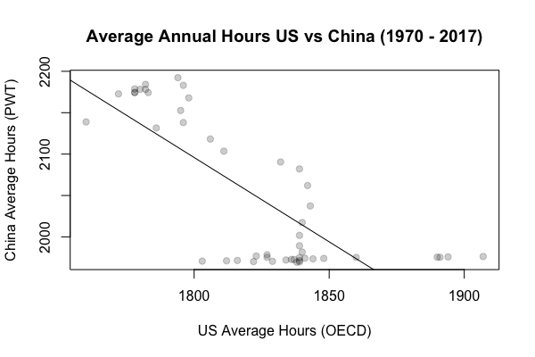

```{r setup, include=FALSE}
knitr::opts_chunk$set(
  comment = "#", fig.height = 4, 
  cache = FALSE,  collapse = TRUE,
  error = TRUE
)
```


\begin{center} 
CSI 2300: Introduction to Data Science

Exam 01 
\end{center} 

**Evelyn Pan**
**Due: Friday, Feb 24, 11:59pm**


The data to be used in this exam comes from https://ourworldindata.org/measure-working-hours.
As the website describes, work is a central part of peoples' lives, so looking closely at how much time spent working can tell us a lot about the societies we live in.
Several international organizations and research centers aggregate the working hours estimates published by national statistical agencies into cross-country datasets. The two most important datasets come from the Organization for Economic Co-Operation and Development (OECD) and the Penn World Table (PWT). These both draw on national accounts estimates when available, but they can differ in the other sources they use and their method of aggregation. The data on working hours is not perfect, but it can still tell us a lot about our lives and the world.

**Exam Guidelines:**

* Show your code for every question.
* Submit your solutions as a .pdf knitted from a Markdown document.
* The exam is designed to take no more than 2 hours, but there is no time limit.
* You may use your notes and any online resources.
* You may not confer with other students or people.
* If you have a question, Dr. Benton will be on hand to answer them via email (marylauren_benton@baylor.edu) or during office hours on Monday.


1. Read in the `compare-sources-working-hours.csv` file.  
 What is its size (i.e., number of rows and number of columns)? (8 points)

```{r}
setwd("/Users/evelynpan/Desktop/CSI 2300/Exam 1")
hours <- read.csv(file="compare-sources-working-hours.csv")
                  
hours_rows = nrow(hours)
hours_rows
hours_cols = ncol(hours)
hours_cols
```
 **number of rows: 3604**
 **number of columns: 7**
 **There are 3604 observations of 7 variables**

2.  Change the column names to labels that are easy to work with.  
 We suggest `pwt_hours`, `bick_hours`, `huberman_hours`, `oecd_hours` for columns 4 through 7, respectively. (4 points)

```{r}
colnames(hours) <- c("entity", "code", "year", "pwt_hours", "bick_hours", "huberman_hours", "oecd_hours")
```
 

3.  Create a boxplot of the OECD hours by year.  (5 points)
    a. Overlay a red horizontal line at 2000 hours (2000 = 40 hours/week x 50 weeks/year) for reference. The `abline()` command may be helpful here. (4 points)
    b. Add nice x and y-axis labels. Put a title on the plot. (4 points)
    c. What do you observe in this plot? (4 points)
(2000 = 40 hours/week x 50 weeks/year)

```{r}
boxplot(oecd_hours~year, 
  data=hours,
  main="OECD Hours by Year")
abline(h = 2000, col = "skyblue1")

```
**What I observe in this plot: the box and whisker plots toggle up and down. From the mid 1961 - 2016, the box and whisker plots fall under 2000 OECD hours.**

4.  Which countries have had less than 1400 annual average OECD work hours? (5 points)
```{r}
boxplot(oecd_hours~entity, 
  data=hours,
  ylim=c(1300, 2500), 
  main="OECD Hours by Countries")
abline(h = 1400, col = "turquoise2")

```
**Countries Denmark, Iceland, Norway, and Spain have had less than 1400 annual average OECD work hours.**

5.  How many observations are there for the United States? (5 points)
**There are 77 Observations of 7 variables for the United States.**
```{r}
us_hours <- hours[hours$entity == "United States" ,]

```


6.  Filter the data to just the U.S. observations. You will create a plot that looks like the one given below.
    a.  Beginning in 1950, plot the OECD average annual working hours in the U.S. by year. (5 points)
    b. Add another line that shows the PWT average annual working hours, and use a different line type. (4 points)
    c. Add a legend. (4 points)
    d. Comment on what trend(s) you see in this plot. (4 points)

```{r}
plot(us_hours$year, us_hours$oecd_hours, type="l", lwd = 2, xlim = c(1950, 2019), ylim = c(1600, 2100))
lines(us_hours$year, us_hours$pwt_hours, type = "l", lwd = 2, lty = 2)

legend("bottomleft", c("OECD", "PWT"), lty = c(1, 2),
       lwd = c(2,2), bty = "n")

```


7.  Using the OECD values, what are the mean and standard deviation of the average annual working hours observed in the U.S. in the years for the following two decades:
    a.  1950 to 1959 (inclusive) (4 points) **mean: 1980.3 & standard dev: ~18.486**
    b.  2010 to 2019 (inclusive) (4 points) **mean: 1779.125 & standard dev: ~18.488**
    c.  What do these values tell you about each decade? (4 points) 
    
```{r}
part_a <- us_hours$oecd_hours[us_hours$year > 1949 & us_hours$year < 1960 ]
mean = mean(part_a)
standev = sd(part_a)

part_b <- us_hours$oecd_hours[us_hours$year > 2009 & us_hours$year < 2018 ]
mean2 = mean(part_b)
standev2 = sd(part_b)
```


8. The average annual working hours of different countries may move together since one nation's economy may depend on another nation. You will create a plot that looks like the one given below.
    a. Create a data frame with just the observations for China. (4 points) 
    **There are 48 observations of 7 variables for China.**
```{r}
china_hours <- hours[hours$entity == "China" ,]
```
    
  b. Intersect the years of the U.S. data frame and the Chinese data frame. (5 points)
```{r}
intersecting <- intersect(us_hours$year, china_hours$year)
```
    
  c. Create a set of ordered pairs, U.S. OECD hours worked in the same year as the Chinese PWT hours worked.  There will be 48 of them. (5 points)
```{r}
new_frame <- china_hours[china_hours$year%in%intersecting, ]
new_frame2 <- us_hours[us_hours$year%in%intersecting, ]
```
    
  d. Create a scatterplot with the annual U.S. OECD hours worked on the x-axis and China's annual PWT hours worked on the y-axis. (4 points)

```{r}

plot(new_frame2$intersecting, new_frame$intersecting, xlab = "US Average Hours (OECD)", ylab = "China Average Hours (PWT)", xlim = c(1800, 1900), ylim = c(2000, 2200), main = "Average Annual Hours US vs China (1970 - 2017)")
```
    
   e. Overlay a straight line fitted through these points.  What are the estimates of the slope and intercept? (6 points)
*lines(1:nrow(new_frame), new_frame$intersecting, col = 1)*

{width=60%}


  f. What is the R-squared for this model? (4 points)
  

  g. Interpret what this model means in the context of the problem. (4 points)
**This model conveys that the U.S. Average Hours are between 1800 - 1850 hours, while the Average Hours in China is between 2100 - 2200.**


**BONUS:** Color the points in the scatterplot with a unique color corresponding to its year.  Label the colors for the years. What additional information does adding color for each year provide? (6 points)

